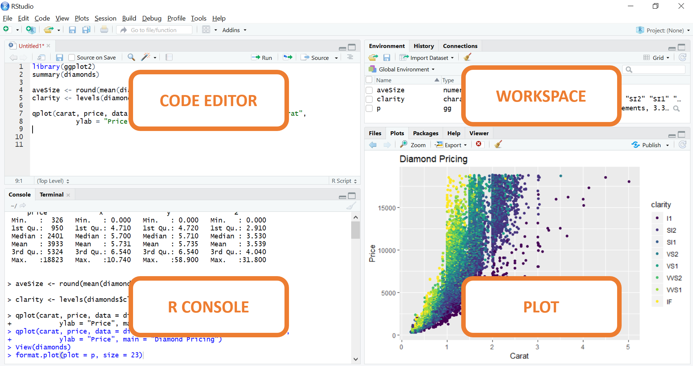
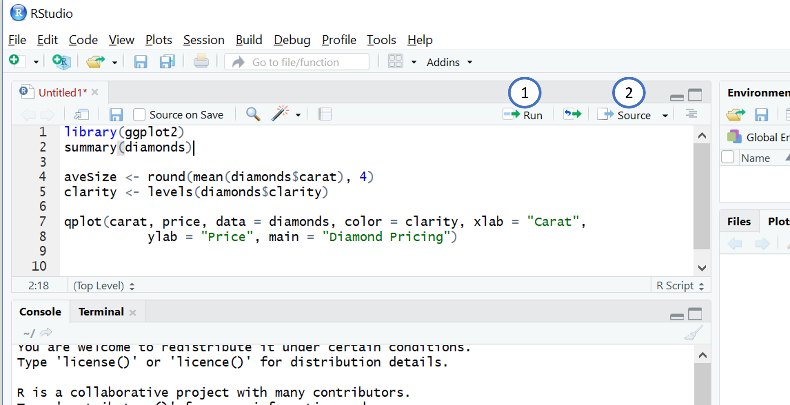
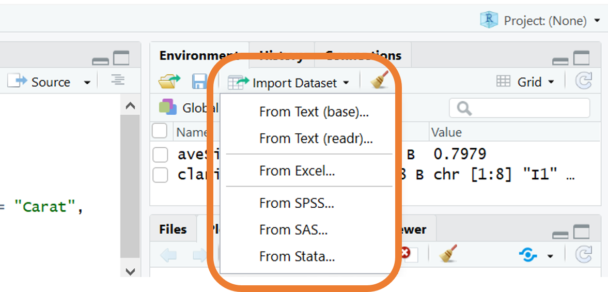

---
output:
  html_document: 
    toc: true
    toc_float: true
---

```{r global_options, include=FALSE}
knitr::opts_chunk$set(warning=FALSE, message=FALSE)
```

<link rel="stylesheet" href="styles.css" type="text/css">

# Installazione di R 

Per installare l’ultima versione di R bisogna andare sulla pagina [CRAN](https://cran.r-project.org/):

* cliccare *Download R for Windows*
* cliccare *Base*
* cliccare *Download R 3.x.x for Windows* al cui seguito avrà inizio il download.
* Procedere con l'installazione dell'applicazione, selezionare la lingua di utilizzo e seguire le istruzioni.


# Installazione di RStudio

Come tutti i linguaggi di programmazione è opportuno lavorare su un’interfaccia IDE, cioè un’applicazione grafica con una serie di strumenti che ci possano aiutare nello sviluppare ed eseguire il codice. RStudio è un ambiente di sviluppo integrato (IDE) per R. E’ un software open-source che gira su Linux, Mac OS X e Windows e può essere scaricato dal sito di [RStudio](http://www.rstudio.com)

* Cliccare il pulsante *Download RStudio Desktop*
* Procedere con l'installazione.

Completata l'installazione, accedere ad RStudio che rileverà R in automatico. 


L’ambiente di lavoro di RStudio è costituito da quattro finestre le cui funzioni principali sono:

1. Code Editor (editor di testo per scrivere ed eseguire lo script);
2. R Console (riga di comando, esegue i comandi in modalità batch e mostra output);
3. Workspace (informazioni riguardo gli oggetti creati, cronologia dei comandi);
4. Plot (mostra gli output grafici, help)



<br>

Prima di procedere con una nuova attività di analisi, è consigliabile aprire uno nuovo script. Dall'interfaccia di RStudio cliccare su `File` e selezionare `R Script`. Successivamente procedere con il salvataggio del file.


<br>

Per eseguire il codice riportato nello script:

1. utilizzare il comando `Run` se si vuole eseguire la riga su cui è posizionato il cursore
2. utilizzare il comando `Source` se si vuole eseguire tutto il codice contenuto nello script


<br>

Per utilizzare R da linea di comando è necessario digitare il codice direttamente nella console.


# Oggetti e Funzioni

Per comprendere la programmazione in R, questi due concetti potrebbero esserti di supporto:

* Tutto ciò che esiste è un oggetto.
* Tutto ciò che accade è una chiamata ad una funzione.

Gli oggetti sono i nostri *mattoncini* lego mentre le funzioni le *istruzioni*.

Attraverso le *istruzioni* manipoliamo i nostri *mattoncini*, così le funzioni ci permettono di manipolare gli oggetti. Gli oggetti sono come contitori che contengono l'informazione. Un oggetto può contenere un set di dati o i dati di un modello.
Per muovere e modificare questi oggetti abbiamo bisogno delle funzioni. Tutto è una funzione, dal calcolo della media da un algoritmo di deeplearning. Per esempio la media è una funzione che agisce su una serie di dati resituendo un numero. La funzione di deep learning agisce su un dataset restituendo un modello.   

Questi due concetti, oggetto e funzione, sono essenziali e saranno  ripresi nel proseguo di questo tutorial.


# Comandi di base


Il simbolo `#` serve a commentare e qualunqua cosa scritta alla sua destra non verrà eseguita:

```{r}
# commento
```
 
La linea di comando può essere utilizzata come una vera e propria calcolatrice, come è illustrato dal seguente codice:

```{r}
21+1+18
sqrt(14)-21/3
```
Le operazioni matematiche di base sono

* `+` addizione
* `-` sottrazione
* `*` moltiplicazione
* `/` divisione
* `^` elevamento a potenza

Per assegnare un valore ad una variabile si usano i simboli `<-` . Tale operazione permette di memorizzare l'informazione richiesta in un nuovo oggetto nell'ambiente di lavoro (workspace). 

```{r}
a <- 12
a
```

Informazioni sull'ambiente di lavoro possono essere ottenute nel riquadro di RStudio in alto a destra.

Gli oggetti insieme le funzioni sono le strutture basilari della programmazione in R.

* Tutto ciò che esiste in memoria è un oggetto.
* Tutto ciò che accade è una funzione.

Un oggetto può essere di diverso tipo, i più comuni sono i vettori.

## Le funzioni 
Le funzioni hanno una scrittura di questo tipo `fun(arg1,arg2...)` dove:

* `fun()` è il nome della funzione 
* `arg1,arg2,...` sono gli argomenti che vengono passati alla funzione

Il risultato può essere salvato in un oggetto tramite l'operatore assegnazione. 

In R è possibile chiedere aiuto con `help` on con `?` seguito dal nome della funzione. In basso a destra, nel riquadro *Plot* si aprirà una finestra con un help relativo alla funzione. E' fondamentale imparare a leggere il manuale perchè permette di navigare attraverso le funzioni esistenti per sfruttarne efficacemente le potenzialità. Nell'esempio la funzione `c()`, che è utilizzata per la creazione di nuovi oggetti come verrà illlustrato nel successivo paragrafo.
```{r,eval=F}
help(c) 
?c()
```


## Vettori e Data Frames
Pper sfruttare al meglio il linguaggio R, è necessaria una solida comprensione dei tipi e delle strutture di dati e di come operare su di essi.

I vettori sono le strutture di dati più basilari in R. 

Con la funzione `c()`, *combine* , creiamo un vettore elencando gli elementi  separati da una virgola
```{r}
vec1 <- c(18,2,3)
vec1
vec2 <- c(7.2,55,29)
vec2
vec3 <- c("Lorem","Ipsum","Dolor")
vec3
```

*Nota bene*: I vettori sono essenzialmente una raccolta ordinata di valori dello stesso tipo di dati atomici. Quindi, cosa succede quando viene creato un vettore con dati di tipo diverso? Gli elementi del vettori vengono trasformati per dare una versione consistente del vettore. Nel prossimo esempio la funzione `class()` è utilizzata per conoscere la classe del vettore. 

```{r}
y1 <- c(1.7, "a")   ## character
class(y1)
y2 <- c(TRUE, 2)    ## numeric
class(y2)
y3 <- c("a", TRUE)  ## character
class(y3)
```

La struttura più utilizzata per elaborare i dati in R è il dataframe, è ideale perchè lavora con dati strutturati e può contenere tutti i tipi di dati.
Un dataframe è una lista di vettori (solitamente, gli attributi), che devono avere tutti la stessa lunghezza (numero di casi, istanze), ma possono essere di tipo diverso. Per creare un dataframe utilizziamo la funzione `data.frame()` e elenchiamo i vettori che comporranno il dataset finale

```{r}
df <- data.frame(vec1,vec2,vec3)
```


Tutte le variabili (scalari, vettori, matrici, dataframes) creati in R sono oggetti.


## Accesso ai dati

Ci sono diversi modi per accedere agli elementi di un vettore o dataframe, il più comune sfrutta le parentesi quadre e utilizza uno o più indici per indicare la posizione di un elemento:

```{r}
vec1[2] # ritorna il secondo elemento del vettore
df[2,1] # ritorna l'elemento della seconda riga e prima colonna
```

Oppure, nel caso di dataframe, utilizzando il nome della colonne all'interno delle parentisi quadre

```{r}
df[1,"vec1"] # ritorna l'elemento della prima riga e della colonna di nome "vec1"
```

Per selezionare una colonna all'interno del dataframe si può utilizzare il simbolo `$` dopo il nome del dataset. A seguito del simbolo `$` specificare il nome dell'attributo. Il risultato di questa operazione è quello di creare il vettore relativo all'attributo.

```{r}
df$vec1
```

Tale modalità è utilizzata anche per estrarre informazioni all'interno degli oggetti che sono risultati di funzioni comeplessi, come gli oggetti creati dalle funzioni che producono modelli. Tale discussione è lasciata alle sezioni successive.

## Variabile categorica 

Le variabili categoriche sono variabili che assumono un numero limitato di valori diversi. La funzione `as.factor()` viene utilizzata per creare una variabile categorica (factor).

```{r}
# vettore carattere
dat <- c("bianco","nero","nero","nero","bianco","grigio")
class(dat)
# vettore categorico
fdat <- as.factor(dat)
class(fdat)
```


## Funzioni utili

Elenco di funzioni utili:

* `length(object)`  numero di elementi in un vettore
* `str(object)`   mostra la struttura di un oggetto/variabile
* `head(variabile)` mostra i primi 6 elementi di una variabile
* `tail(variabile)` mostra gli ultimi 6 elementi di una variabile
* `class(object)` classe di un oggetto
* `names(object)` nome degli attributi  

* `c(object,object,...)` concatena gli oggetti in un vettore      
* `cbind(object, object, ...)` concatena gli oggetti per colonna
* `rbind(object, object, ...)` concatena gli oggetti per riga 


## Installazione e caricamento di una libreria


Un pacchetto in R è un insieme di funzionalità pre-costruite. Le funzioni possono calcolare una funzione matematica, ad esempio somma o creare un grafico. Di fatto, ciò che rende R una piattaforma statistica formidabile è la straordinaria ricchezza di pacchetti disponibili (ben oltre 12000 al momento della scrittura). In R, i pachetti vengono installati tramite la funzione `install.packages("nomepachetto")`

```{r,eval=F}
install.packages("ggplot2")
```

Una volta installato il pachetto è possibile chiamare le funzioni della libreria tramite il comando `library("nomepachetto")`

```{r,eval=F}
library("ggplot2")
```

Solo a seguito di questo comando le funzione del pachetto sono disponibili perchè vengono caricathe nell'ambiente di lavoro (workspace) 

## Importare i dati in R 

R ha numerose funzioni che permettono di connettersi a sorgenti di vario tipo e leggere i dati dai formati più comuni.
R fornisce un intero [manuale](https://cran.r-project.org/doc/manuals/r-release/R-data.html) che descrive il processo di importazione/esportazione dei dati.

R può importare dati contenuti in file CSV in maniera molto flessibile. 

Il modo più semplice e pratico per importare i dati è utilizzare la finestra in alto a sinistra `Environmnet` e cliccare su `Import Dataset`, poi utilizzare l'opzione `From Text(readr)`. 



Oppure utilizzando la funzione `read.csv()` e specificando il percorso del file all'interno della funzione.

```{r,eval=F}
dat <- read.csv("C:/dataset/iris.csv")
```


# Formula

Nella sintassi di R esiste un'espressione particolare che viene utilizzata in certi grafici (esempio in `ggplot2`) e in alcune funzioni che creano modelli predittivi (esempio nella funzione `lm()`).
Tale sintassi prende il nome di `formula` e utilizza il simbolo tilde `~`.

```{r}
y ~ x + z
```


La variabile sul lato sinistro della tilde è chiamata "variabile dipendente", mentre le variabili sul lato destro sono chiamate "variabili indipendenti" e sono unite dal segno +. Tale espressione utilizzata all'interno di alcuni funzioni esprime una relazione tra le variabili.
Si possono avere maggiori informazioni a riguardo grazie il manuale creato da Datacamp:

[Formulas in R Tutorial](https://www.datacamp.com/community/tutorials/r-formula-tutorial)


